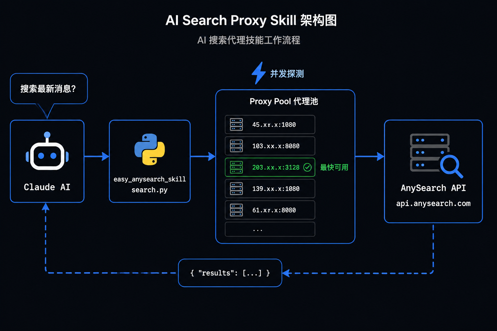

# easy_anysearch_skill

一个 Claude Code Skill，当用户需要搜索互联网或获取知识截止日期后的实时信息时，通过 [AnySearch](https://www.anysearch.com/home) 获取搜索结果。



## 功能特性

- **自动触发**：用户询问最新资讯、当前事件、实时数据时自动激活
- **代理池**：并发探测全部代理，第一个可用代理立即使用，有效绕过速率限制
- **自动兜底**：代理不可用时自动切换直连
- **依赖自管理**：使用 `uv` 运行，无需手动安装依赖

## 安装

将本目录放到 Claude Code 的 skills 目录下：

```bash
# 克隆到 skills 目录
git clone git@github.com:luoqianyi/easy_anysearch_skill.git ~/.claude/skills/easy_anysearch_skill
```

## 使用

Claude Code 会根据对话内容自动调用，也可以手动执行脚本：

```bash
uv run ~/.claude/skills/easy_anysearch_skill/search.py "搜索关键词"
uv run ~/.claude/skills/easy_anysearch_skill/search.py "搜索关键词" 20  # 指定返回条数
```

返回 JSON：

```json
{
  "query": "搜索词",
  "results": [
    {"title": "标题", "url": "链接", "snippet": "摘要"}
  ],
  "error": null,
  "via": "http://1.2.3.4:8080"
}
```

## 环境变量

| 变量名 | 说明 | 默认值 |
|--------|------|--------|
| `ANYSEARCH_API_KEY` | API Key（有则优先使用） | 空 |
| `ANYSEARCH_PROXIES` | 自定义代理列表，逗号分隔 | 空 |
| `ANYSEARCH_PROXY_LIST_URL` | 代理列表 URL | `https://cdn.jsdelivr.net/gh/parserpp/ip_ports/proxyinfo.json` |

## 代理机制

1. 从 `proxyinfo.json` 加载代理列表，按 `response_time` 升序排列
2. 全量并发探测（最多 50 个并发），第一个响应的可用代理立即采用
3. 代理失败时自动切换直连兜底

## 依赖

- Python >= 3.10
- [uv](https://docs.astral.sh/uv/)（自动管理 `requests`, `requests[socks]`）
